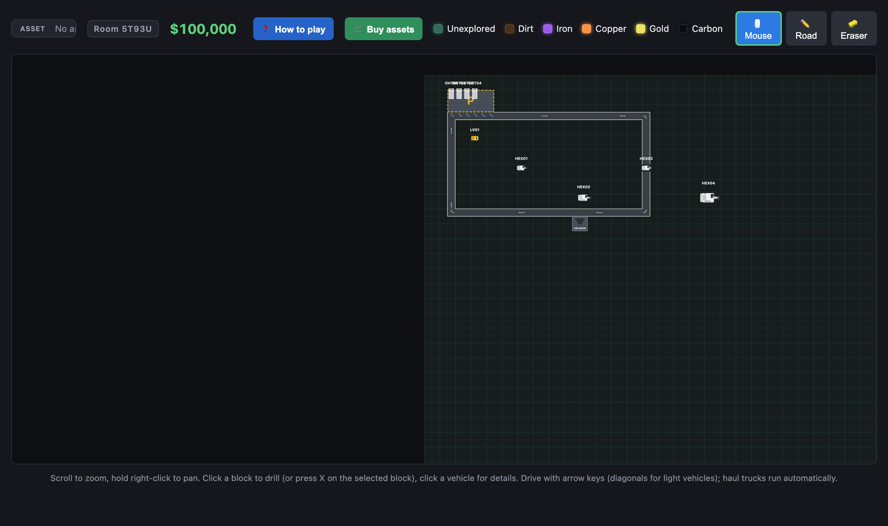
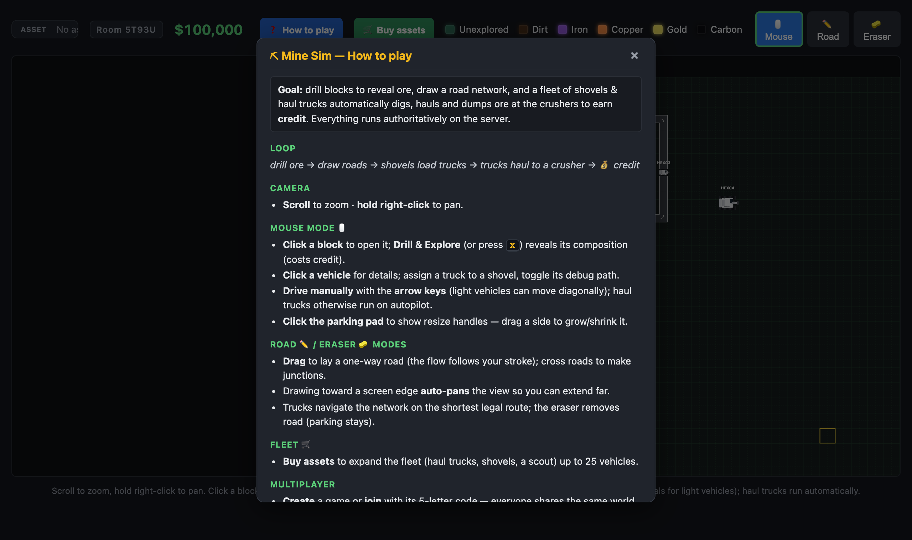
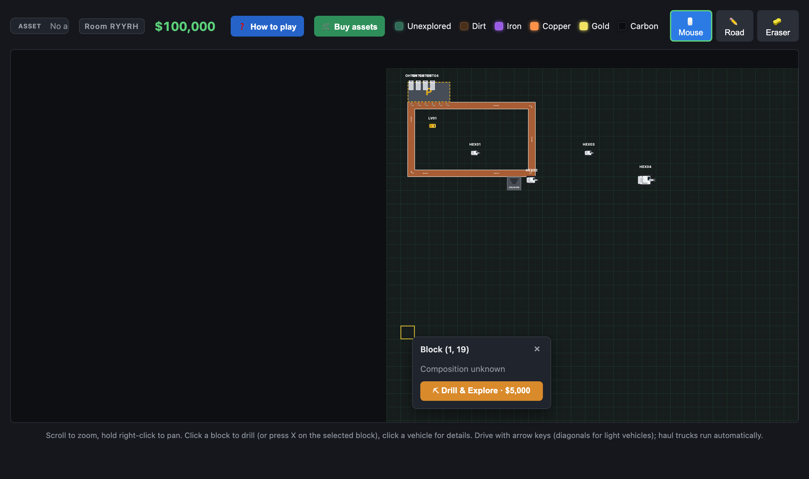
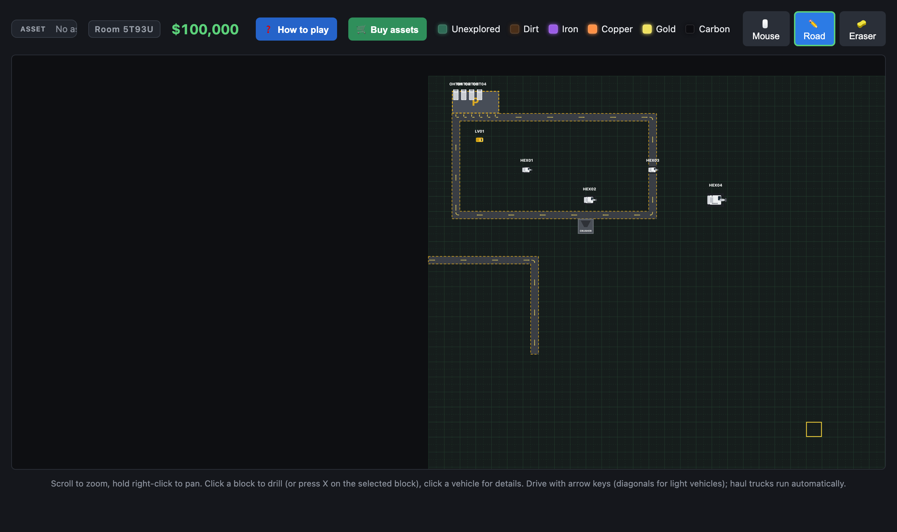
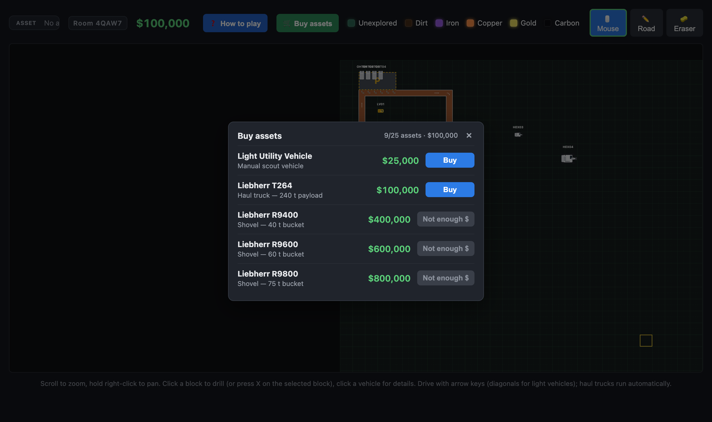
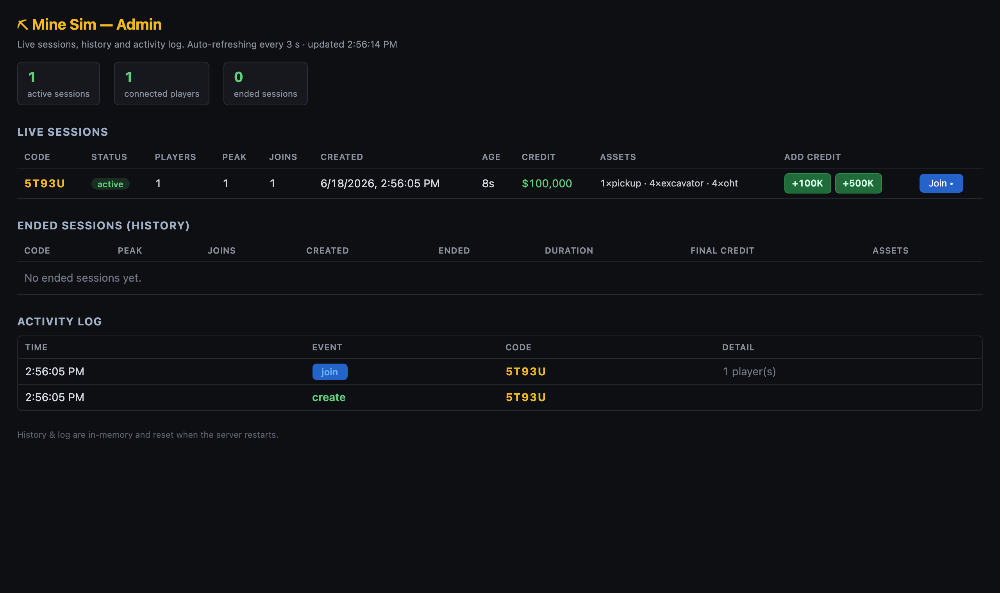

# ⛏ Mine Sim — Open Pit

A real-time, multiplayer **open-pit mine simulation**. You drill a grid of mining
blocks to reveal ore, draw a one-way road network, and a fleet of vehicles
(shovels and haul trucks) automatically digs, hauls and dumps ore at the crushers
to earn credit. Everything is **authoritative server-side**; browsers only render
snapshots and send commands.

```
drill ore → draw roads → shovels load trucks → trucks haul to a crusher → 💰 credit
```



---

## Table of contents

- [Quick start](#quick-start)
- [How to play](#how-to-play)
- [High-level architecture](#high-level-architecture)
- [Low-level architecture](#low-level-architecture)
- [Code architecture](#code-architecture)
- [Classes](#classes)
- [Interfaces & messages](#interfaces--messages)
  - [WebSocket protocol](#websocket-protocol)
  - [Admin HTTP API](#admin-http-api)
- [Security](#security)
- [Admin dashboard](#admin-dashboard)
- [Tests](#tests)
- [Deployment](#deployment)
- [License](#license)

---

## Quick start

```bash
npm install
npm start                 # http://localhost:3200  (PORT to override)
```

Open the URL, **create a game** (or join with a 5-letter code) and start playing.
The admin password is generated on first run and printed to the server logs:

```
[admin] http://localhost:3200/admin  user=admin  pass=XXXXXXXX  (generated: /app/.env)
```

---

## How to play

Click **❓ How to play** in the top bar for the in-app guide.



**Goal:** reveal ore, connect it to a crusher with roads, and let the fleet haul
it for credit.

### Drilling

Click a block to open it; **Drill & Explore** (or press <kbd>X</kbd> on the
selected block) reveals its composition for a fee. Drilled blocks show their
dirt/ore split and remaining tonnage.



### Roads

Switch to **✏️ Road** mode and drag to lay a **one-way** road — the flow follows
your stroke. Cross roads to form T/X junctions; trucks take the shortest legal
route and never drive against an arrow. Drawing toward a screen edge auto-pans
the view so you can extend far. **🧽 Eraser** removes road (parking pads stay).



> Tip: a **one-way loop** around your shovel and crusher roughly doubles haul
> throughput versus a single two-way lane — trucks never meet head-on.

### Fleet

Click **🛒 Buy assets** to expand the fleet (haul trucks, shovels, a scout, a
**dozer**, a **grader**), up to 150 vehicles. A new shovel never spawns within 2
blocks of another, and a spent shovel **relocates on its own** to nearby explored
ore — never settling on a road, always leaving room for trucks to come and load.
You can also buy **extra crushers** (up to 5, $1,000,000 each) and click the map
to place them.



### Camera & vehicles

- **Scroll** to zoom, **hold right-click** to pan.
- **Click a vehicle** for details — assign a truck to a shovel, toggle its debug
  path. **Drive manually** with the arrow keys (light vehicles move diagonally);
  haul trucks otherwise run on autopilot. A manually-driven vehicle may **pass
  through others**, so you can always free a boxed-in asset by hand.
- **Move to a point:** with a vehicle selected, press <kbd>W</kbd> (or the
  **🎯 Move to…** button), then click a destination — it **beelines straight
  there across terrain** (no road-following detours), bending only around
  crushers and parked machines, and passing through traffic rather than ever
  getting stuck.
- **Click the parking pad** to show resize handles; drag a side to grow/shrink it
  (roads under the new pad are trimmed automatically).

### On a phone 📱

The UI is **responsive** and fully playable by touch:

- **One finger** pans the map (in Mouse mode); **pinch** to zoom.
- **Tap** a block to open it, **tap** a vehicle for details.
- In **Road / Eraser** mode, **drag one finger** to lay or rub out road.
- The top bar collapses to icon-only buttons, the legend is hidden, panels and
  modals go full-screen, and a selected asset's controls dock to the bottom of the
  screen.

### Breakdowns

Shovels and haul trucks are reliable ~99% of the time, but one can **break down at
random**: it **freezes in place, smoking**, a popup alerts you, and it's flagged
**red** (⚠️) in the top-left details panel and the **Fleet** list. To fix it,
**drive a light vehicle (LV) into an adjacent cell** — a green repair ring fills
over ~5 s, then it runs again. (With `TEST_MODE` set, press <kbd>P</kbd> to force a
test breakdown.)

---

## High-level architecture

```
                 WebSocket (JSON)                         in-process
  ┌──────────┐  ───────────────►  ┌───────────────┐  ┌──────────────────┐
  │ Browser  │   commands          │  server.js    │  │  Room (per code) │
  │ (client) │                     │  / server/    │──│   World  (autho- │
  │  canvas  │  ◄───────────────  │  Express + ws │  │   ritative sim)  │
  └──────────┘   state + deltas    └───────────────┘  └──────────────────┘
        ▲                                  │ Basic-auth HTTP
        │ renders snapshots                ▼
        │                           ┌───────────────┐
        └── no game logic           │ /admin (page) │  sessions · log · credit
                                    └───────────────┘
```

- **Authoritative server.** All gameplay state lives in a `World` and is advanced
  by `tick(dt)` at 30 Hz. Clients are thin: they render server snapshots and send
  commands — they contain no game rules.
- **Rooms.** Each room is an isolated `World` behind a shareable 5-letter code.
  Ticks and broadcasts are per-room; empty rooms freeze and are reaped after a
  grace period (default 2 h), with a summary archived for the admin log.
- **Networking.** JSON over a single WebSocket. On join the server sends one full
  `state`; thereafter it sends per-tick **deltas** (`live`) carrying only changed
  vehicle fields, touched blocks and credit changes (broadcast at 15 Hz).
- **Admin.** A Basic-auth HTTP surface (`/admin`) lists live/ended sessions, an
  activity log, and can grant credit — same process, separate auth.

---

## Low-level architecture

**Tick loop** ([`server/loop.js`](server/loop.js)). One `setInterval` at 30 Hz
iterates the rooms; occupied rooms `tick(dt)`. Every second tick (15 Hz) it
computes a delta and broadcasts it. Empty rooms are skipped (frozen). Two more
timers run a WebSocket **heartbeat** (ping/terminate dead sockets through proxy
idle timeouts) and the empty-room **reaper**.

**Delta broadcasting** ([`World.liveDelta`](game/world.js)). The world keeps the
last values sent per vehicle/credit and emits only what changed — per-vehicle
field diffs, dirty blocks, and credit — or `null` when nothing changed (the frame
is skipped entirely). This keeps bandwidth tiny even with a full fleet.

**Autopilot** ([`Autopilot`](game/autopilot.js)). Haul trucks navigate the
player-drawn network with a **cached distance field**:

- A reverse BFS from each destination produces a shortest-path distance field
  that **respects one-way arrows**. Fields are cached per goal-set and
  invalidated wholesale when roads change, so pathfinding costs ~0.01 ms/tick.
- Trucks greedily descend the field, re-evaluated every tick — always the
  shortest legal route, with no back-and-forth jitter.
- A blocked step makes a truck wait, then take a free **detour**; true head-on
  **deadlocks** on a single lane are broken by a committed *yield* — the
  lower-priority truck pulls aside onto **open ground** (never onto a crossing
  lane) and resumes when the other has passed, left the area, or on a timeout,
  so a yield can never hold forever.
- **Docking.** A truck prefers to load from a road cell touching the shovel; if
  none is reachable it leaves the road, nuzzles into the adjacent sub-cell, loads,
  then rejoins the network. A docking truck that can't reach the shovel releases
  its claim instead of starving the queue.
- **Dodging & recovery.** If a shovel boxes a truck in on the road with no road
  detour, the truck skirts it off-road via a bounded BFS and rejoins past it.
  Wherever a manoeuvre leaves a truck off-road, a wide nearest-road search +
  obstacle-avoiding BFS always walks it back onto the network — a truck can
  never be stranded.
- **Shovel relocation.** A spent shovel auto-moves to the nearest explored ore
  block — never settling on (or straddling) a road, always leaving a dock cell
  for trucks, and never onto a block another shovel works. An idle shovel
  sitting on tarmac pulls itself aside.
- **Parking.** Trucks park nose-up *en bataille* on a slot grid whose footprint
  (body + rear gap) stays fully inside the pad — a parked truck can never block
  a road along the pad's edge. Slots are assigned nearest-free and re-validated
  against real occupancy; with the pad full, trucks wait on open ground beside
  it and take the first freed slot or job.
- **Graders.** Each idle grader is dispatched to the worn road cell shortest to
  reach (one-way aware). Two graders never target the same cell: they fan out
  to distinct areas, and spare graders rest at the parking pad.

**Collision.** Vehicles reserve grid cells via their rotated footprint; trucks
reserve a tight footprint plus the cell **behind** them so a follower keeps a
body-length gap (sprites never touch) while the front stays free to nuzzle a
shovel/crusher.

**Rendering.** The client draws four layered canvases (mine, roads, vehicles,
popups) through a shared camera transform. Static layers (mine, roads) are marked
dirty and flushed at most once per animation frame; vehicles animate on their own
rAF for smooth lerping.

---

## Code architecture

```
server.js                 Entry point: createServer() + listen, signal handling.
server/
  app.js                  Composition root — createServer() factory (+ stop()).
  rooms.js                RoomManager: room lifecycle, session/event logs.
  ws-router.js            WebSocket connection + message routing.
  validators.js           Inbound-message validation/sanitization.
  security.js             Origin allow-listing, client IP.
  rate-limit.js           Per-connection token-bucket limiter.
  admin-routes.js         Express router for /admin* (Basic auth).
  loop.js                 30 Hz tick, heartbeat, reaper timers.
  transport.js            send() / roomBroadcast() helpers.
admin.js                  Admin helpers (auth, password persistence, snapshots).
admin.html                Admin dashboard (standalone, served behind auth).
game/
  world.js                Authoritative World orchestrator (tick, commands, snapshots).
  vehicle.js              Vehicle physics (cell movement, collision footprint).
  roads.js                Authoritative road network model.
  autopilot.js            Haul autopilot: task FSM, pathfinding, anti-jam.
  min-heap.js             Binary heap for the move-to A* planner.
  constants.js            Shared gameplay constants + tiny helpers.
  mine.js                 Mine generation + block/ore model + rich veins.
public/
  index.html              UI shell, lobby, canvas layers, modals.
  app.js                  Client bootstrap, input, modals, parking resize.
  style.css               Styles.
  components/
    game-canvas.js        Mine grid renderer + block clicks (GameCanvas).
    vehicle.js            Vehicle + Fleet renderer, manual driving.
    roads.js              Road editor/renderer, edge-pan, parking helpers.
    block-popup.js        Block composition popup (BlockPopup).
    camera.js             Shared camera transform + coordinate helpers.
    net.js                WebSocket client (Net).
    mine.js               Shared colour/label constants.
scripts/
  capture-screenshots.js  Playwright script that regenerates docs/screenshots.
test/unit/                Vitest suites (game / server / client).
test/visual/              Playwright visual-regression tests (canvas renderers).
test/load/                Standalone WebSocket load generator.
eslint.config.js          ESLint (flat config); `npm run lint`.
```

---

## Classes

### Server — authoritative game ([`game/`](game))

| Class / module | Responsibility |
| --- | --- |
| **`World`** | The whole authoritative state. `tick(dt)` advances the sim; commands: `drill(x,y)`, `buyAsset(id)`, `setRoads(cells)`, `resizeParking(rect)`, `addCredit(amount)`, `control/assign/select/setDebug`, `reset()`. Snapshots: `fullState()` (full) and `liveDelta()` (changed-only). |
| **`Vehicle`** | One unit (`pickup` \| `excavator` \| `oht`). Holds pose/load/heading; `update(dt,dir,…)` moves it a cell at a time, `footprintAt()` / `collisionCells()` compute reserved grid cells. |
| **`Roads`** (server) | The road-cell store (`Map` of sub-zones with optional one-way `dir` + parking flag). `setNetwork(cells)`, `serialize()`, `addParking()`. |
| **`Autopilot`** | Haul logic: distance-field pathfinding, truck phases (`to_shovel → docking → loading → undocking → to_crusher → dumping → to_parking`), deadlock/yield, shovel dodge & relocation. |
| `mine.js` | `generateMine(cols,rows)` builds the ore-bearing grid; `setOre(block,ore,pct)` seeds a deposit. |

### Server — infrastructure ([`server/`](server), [`admin.js`](admin.js))

| Class / module | Responsibility |
| --- | --- |
| **`RoomManager`** | Creates rooms (crypto-random codes), tracks clients/peaks/joins, logs events, archives & reaps empty rooms. |
| **`RateLimiter`** | Per-connection token bucket (`allow(ws)`), state stored on the socket. |
| `createServer(opts)` | Composition root: wires rooms, admin routes, static client, the WS router and the loops; returns `{ app, server, wss, rooms, stop }` (testable). |
| `ws-router.js` | `setupWebsocket()` + `handleMessage()` — validate → rate-limit → route. |
| `validators.js` | `validateLobby()` / `validateCommand()` — bounds/type checks per message. |
| `security.js` | `verifyOrigin()` (anti-CSWSH), `parseOrigins()`, `clientIp()`. |
| `admin.js` | `loadOrCreateAdminPass()`, `checkAuth()`, `sessionSummary()`, `buildAdminData()`. |

### Client ([`public/components/`](public/components))

| Class / module | Responsibility |
| --- | --- |
| **`GameCanvas`** | Renders the mine grid (culled, batched fills) and reports block clicks. |
| **`Fleet`** + `Vehicle` | Renders/animates vehicles; manual driving; selection hit-testing. |
| **`Roads`** (client) | Road editor + renderer (lane markings, arrows), edge auto-pan, parking hit-test/preview. |
| **`BlockPopup`** | Floating block-composition popup with the Drill button. |
| **`Net`** | WebSocket client — connect/reconnect, send commands, dispatch inbound messages. |
| `camera.js` | Shared 2D camera (`scale`, `ox/oy`) + world↔screen helpers. |

---

## Interfaces & messages

### WebSocket protocol

A single WebSocket per client, JSON messages tagged by `t`. Inbound messages are
**validated and sanitized** ([`server/validators.js`](server/validators.js))
before touching a world: types enforced, strings length-capped, coordinates and
the road array bounds-capped.

**Client → server**

| `t` | Payload | Effect |
| --- | --- | --- |
| `create` | — | Create a new room and join it. |
| `join` | `room` | Join an existing room by code. |
| `drill` | `x, y` | Drill a block (block coords); charges the drill cost. |
| `roads` | `cells: [{ gx, gy, dir }]` | Replace the drawn network (sub-zone cells, optional one-way `dir`). |
| `control` | `label`, `dir` \| `release` | Manually drive a vehicle, or hand it back to the autopilot. |
| `moveTo` | `label`, `gx`, `gy` | Drive a vehicle straight to a sub-zone cell (direct line across terrain, around crushers/stationary machines, through traffic). |
| `assign` | `truck`, `shovel` | Assign a haul truck to a shovel (or `null`). |
| `select` | `label`, `on` | Mark a shovel selected (pauses its auto-relocation). |
| `debug` | `label`, `on` | Toggle the vehicle's debug-path overlay. |
| `buy` | `id` | Buy an asset from the catalog. |
| `buyCrusher` | `gx`, `gy` | Buy + place an extra crusher (up to 5, $1M each). |
| `reset` | — | Regenerate the room's world. |
| `resizeParking` | `rect: { x, y, w, h }` | Resize the parking pad (sub-zones). |

**Server → client**

| `t` | Payload | When |
| --- | --- | --- |
| `joined` | `room` | After create/join. |
| `state` | `state` (full snapshot) | On join, and after `reset`. |
| `joinError` | `reason` | `room not found` / `server full`. |
| `drilled` | `x, y, block, credit, error` | Reply to `drill`. |
| `roads` | `cells` | Broadcast to *other* clients after a road edit. |
| `parking` | `rect, cells` | Broadcast after a `resizeParking` (light — not a full state). |
| `bought` | `id, ok, error, credit, label` | Reply to `buy`. |
| `vehicle` | `vehicle` | Broadcast after a successful `buy`. |
| `crusher` | `crusher, extraCrushers` | Broadcast after a crusher is placed. |
| `live` | `vehicles[], blocks[], credit?, debug?` | Per-tick delta (15 Hz); only changed **non-positional** fields. |
| *(binary)* | `pos` frame | Per-tick vehicle positions, compact binary: `[u8 type=1][u16 count]{ u16 id, f32 x, f32 y, f32 heading, u16 gx, u16 gy }`. |

The full **`state`** snapshot carries: `cols`, `rows`, `view {w,h}`,
`blockTonnage`, `credit`, `drillCost`, `parking`, `crushers`, `catalog`,
`maxAssets`, `roads`, `vehicles[]` (each with a stable `id`), and `blocks[]` —
only the **significant** blocks (explored or a vein); the client defaults the rest
to unexplored. WebSocket frames use `permessage-deflate` for the big snapshots.

### Admin HTTP API

All routes require **HTTP Basic auth** (`admin` + the generated password).

| Method · Path | Body | Returns |
| --- | --- | --- |
| `GET /admin` | — | The dashboard HTML page. |
| `GET /admin/api/sessions` | — | `{ now, graceMs, activeCount, playerCount, active[], history[], events[] }` |
| `POST /admin/api/credit` | `{ code, amount }` | `{ ok, code, credit }` · `404` unknown room · `400` bad amount |
| `POST /admin/api/restore` | `{ code }` | Reactivate an **ended** game from its kept snapshot · `{ ok, code }` · `404` not restorable · `409` already live |

A session summary contains `code, createdAt, ageMs, players, peakPlayers,
totalJoins, credit, vehicleCount, assets, status`.

---

## Security

The WS/HTTP surface is hardened ([`server/`](server)):

- **Rate limiting** — per-connection token bucket; persistent flooders are
  terminated, and simultaneous connections per IP are capped.
- **Message-size & bounds caps** — WS `maxPayload` (1 MB) plus per-message
  validation; out-of-grid road cells are dropped and the array is capped, so a
  hostile client can't grow server state without limit.
- **Origin allow-listing** — cross-site WebSocket upgrades are rejected
  (same-origin by default; `ALLOWED_ORIGINS` to override) → anti-CSWSH.
- **Code-enumeration throttle** — repeated failed joins terminate the socket;
  room codes are generated with `crypto.randomInt`.
- **Admin auth** — HTTP Basic with a 72-bit auto-generated password, persisted to
  a `.env` (see below); constant-time comparison.
- **Hardening** — runs as the unprivileged `node` user in Docker; a fatal
  uncaught error logs and exits (clean restart) rather than serving from a
  possibly corrupt state; `SIGTERM`/`SIGINT` shut down gracefully.

---

## Admin dashboard

`/admin` (Basic auth) shows live and ended sessions with player counts, created/
duration timestamps, **credit and asset breakdowns**, a **Join** link, **+100K /
+500K** credit grants, a **↻ Restore** button to reactivate an ended game from its
kept snapshot, and an activity log.



The password is resolved in this order: `ADMIN_PASS` env var → a value in the
`.env` file at `DATA_DIR` → freshly generated and written there. **Mount a volume
at `DATA_DIR`** for the password to survive container redeploys.

---

## Tests

Three kinds, one per directory (each has its own README):

```bash
npm run lint              # ESLint (flat config)
npm test                  # unit (Vitest)          → test/unit/
npm run coverage          # unit + coverage gate (istanbul)
npm run test:visual       # visual regression (Playwright) → test/visual/
npm run test:load -- ...  # WebSocket load generator → test/load/
```

**Unit** ([`test/unit/`](test/unit)) — Vitest, split by layer:

| Path | What it covers |
| --- | --- |
| `test/unit/game/world.test.js` | Vehicles, footprints/collision, the autopilot (pathfinding, overtaking, deadlock/yield timeouts, docking, dodge, off-road recovery), parking (slot grid, occupancy-aware assignment, overflow waiting, resize), grader dispatch/dispersion, shovel spacing & road-clear relocation, rich-vein dozer prep, direct move-to & manual pass-through, a full **haul-cycle integration** run. |
| `test/unit/game/mine.test.js` | Mine generation, ore deposits, rich veins (deterministic via seed). |
| `test/unit/game/admin.test.js` | Auth, session snapshots, **password persistence** across restarts. |
| `test/unit/server/*.test.js` | Validators, security/rate-limit, admin HTTP (**supertest**), **ws integration**, SQLite persistence. |
| `test/unit/client/*.test.js` | Client renderers/helpers in happy-dom (camera, mine, roads, net, vehicle). |

Coverage uses the **istanbul** provider (it merges a CJS module loaded by several
test files correctly, which v8 under-counts). The authoritative `game/` logic is
held to a high bar; the canvas renderers are covered by the visual tests instead.

**Visual** ([`test/visual/`](test/visual)) — Playwright screenshot-regression of
the canvas renderers (dozer, vein mesh, road markings) against committed
baselines. `npm run test:visual:update` regenerates them after an intended change.

**Load** ([`test/load/`](test/load)) — a standalone WebSocket client that ramps
parallel rooms/players to find the server's capacity (set `TEST_MODE=1` to lift
the per-IP caps).

Regenerate the README screenshots from the live app:

```bash
npx playwright install chromium
node scripts/capture-screenshots.js     # writes docs/screenshots/*.png
```

---

## Deployment

```bash
docker build -t mine-sim .
docker run -p 3200:3200 -v minesim-data:/data -e DATA_DIR=/data mine-sim
```

`npm run docker:build` cross-builds (`linux/amd64,linux/arm64`) and pushes the
`jarod68/mine-sim:latest` image. The image is `node:22-bookworm-slim` (Debian/glibc
so `better-sqlite3` installs its prebuilt binary — no compiler, multi-arch clean).

### Persistence

Game rooms, the admin activity log and ended-session history are persisted to
**SQLite** (`better-sqlite3`) at `DATA_DIR/minesim.db` — worlds are stored as
gzip-compressed JSON snapshots ([`game/world.js`](game/world.js)
`toSnapshot()/fromSnapshot()`, [`server/store.js`](server/store.js)). Rooms are
written **behind** the simulation (every ~15 s for changed/live rooms, and on
graceful `SIGTERM` shutdown) and **reloaded on boot**, so a restart/redeploy keeps
every game where it was. **Mount a volume at `DATA_DIR`** for it to survive.

### Scaling (multi-core)

By default one process owns and ticks all rooms (≈1 CPU core). Set **`WORKERS>1`**
to run the **cluster** ([`server/cluster.js`](server/cluster.js)): a thin TCP
gateway on `PORT` routes each connection to a worker by the room code in the URL
(`?room=CODE` — the code's first char encodes its owning worker, so routing is
stateless and survives restarts). Each worker is a full server with its own rooms
and SQLite DB (`minesim-w{N}.db`); the gateway also serves `/admin`, aggregating
the workers over IPC. This spreads rooms across cores while keeping each room's
authoritative sim on one worker.

The simulation itself is tuned for density: collision uses an O(1) occupancy
index, idle rooms tick adaptively (down to ~5 Hz until something moves), and
persistence runs off the main thread.

```bash
WORKERS=4 node server.js     # 4 workers behind the gateway
```

**Environment variables**

| Var | Default | Purpose |
| --- | --- | --- |
| `PORT` | `3200` | HTTP/WS port. |
| `DATA_DIR` | `/data` (Docker) | Holds the admin-password `.env` **and** `minesim.db` — **mount a volume**. |
| `ADMIN_PASS` | — | Override the admin password (else generated/persisted). |
| `ALLOWED_ORIGINS` | — | Comma-separated WS origin allow-list (else same-origin). |
| `TEST_MODE` | `false` | **Load-testing only** — lifts the per-IP connection cap, rate limiter and join-throttle so one machine can stress the server (`scripts/loadtest.js`). Also readable from a `TEST_MODE=true` line in the `.env`. Never leave on in production. |
| `WORKERS` | `1` | `>1` runs the multi-core cluster (gateway + N workers, one SQLite DB per worker). |

---

## License

See [LICENSE](LICENSE).

🔗 **Project on GitHub:** <https://github.com/jarod68/mine-sim>
