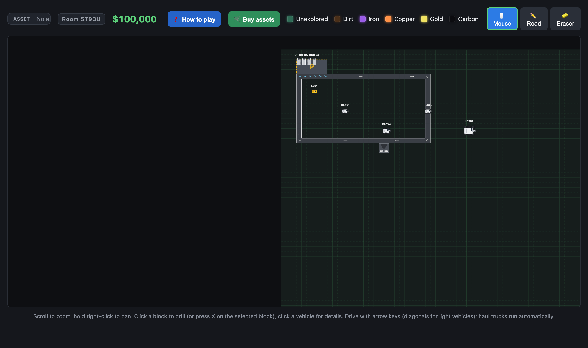
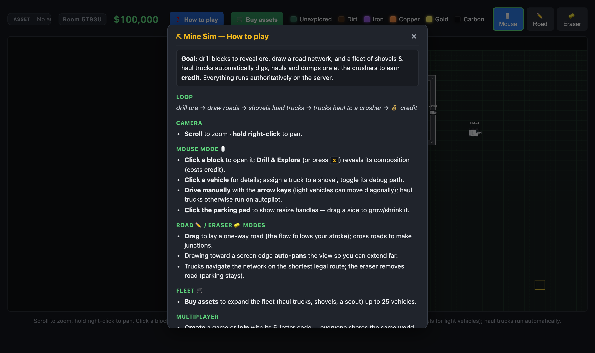
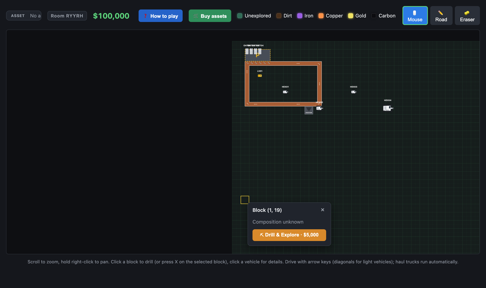
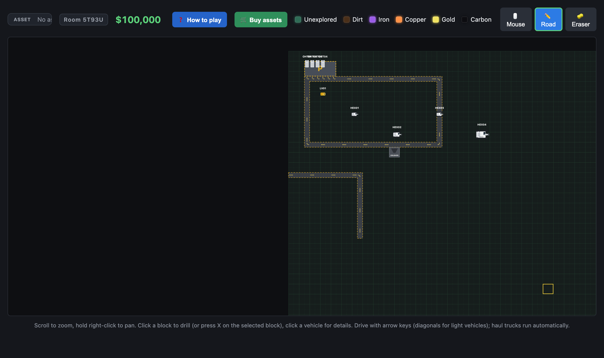
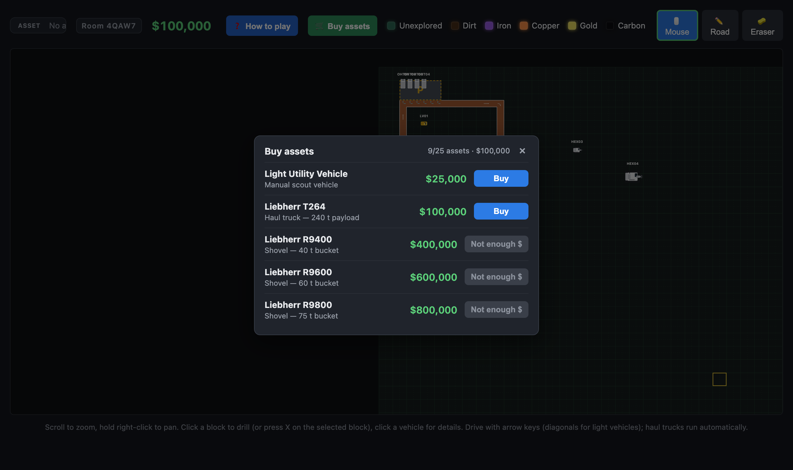

# ⛏ Mine Sim — Open Pit

A real-time **open-pit mine simulation** that runs **entirely in your browser** —
no server, no account, no network. You drill a grid of mining blocks to reveal
ore, draw a one-way road network, and a fleet of vehicles (shovels and haul
trucks) automatically digs, hauls and dumps ore at the crushers to earn credit.

```
drill ore → draw roads → shovels load trucks → trucks haul to a crusher → 💰 credit
```

The whole authoritative simulation lives in a **Web Worker** and autosaves to
**IndexedDB**; the page you download is 100% static files. Close the tab and come
back later — your mine is exactly where you left it.



---

## Table of contents

- [Quick start](#quick-start)
- [How to play](#how-to-play)
- [High-level architecture](#high-level-architecture)
- [Low-level architecture](#low-level-architecture)
- [Code architecture](#code-architecture)
- [Classes](#classes)
- [Interfaces & messages](#interfaces--messages)
  - [Worker protocol](#worker-protocol)
  - [Persistence](#persistence)
- [Tests](#tests)
- [Deployment](#deployment)
- [License](#license)

---

## Quick start

No dependencies to install — the runtime is zero-dependency (`serve.js` uses only
Node built-ins):

```bash
npm start                 # → http://localhost:3200  (set PORT to override)
```

Open the URL and start playing. It **must** be served over HTTP (not opened as a
`file://`) because it uses ES-module Web Workers and IndexedDB. Any static host
works just as well:

```bash
npx serve public          # or: python3 -m http.server 3200 --directory public
```

> Your game autosaves to the browser's IndexedDB. To start over, use the in-app
> reset, or clear the site's storage (DevTools → Application → IndexedDB →
> `minesim`), or just open a private window.

---

## How to play

Click **❓ How to play** in the top bar for the in-app guide.



**Goal:** reveal ore, connect it to a crusher with roads, and let the fleet haul
it for credit.

### Drilling

Click a block to open it; **Drill & Explore** (or press <kbd>X</kbd> on the
selected block) reveals its composition for a fee. Drilled blocks show their
dirt/ore split and remaining tonnage.



### Roads

Switch to **✏️ Road** mode and drag to lay a **one-way** road — the flow follows
your stroke. Cross roads to form T/X junctions; trucks take the shortest legal
route and never drive against an arrow. Drawing toward a screen edge auto-pans
the view so you can extend far. **🧽 Eraser** removes road (parking pads stay).



> Tip: a **one-way loop** around your shovel and crusher roughly doubles haul
> throughput versus a single two-way lane — trucks never meet head-on.

### Fleet

Click **🛒 Buy assets** to expand the fleet (haul trucks, shovels, a scout, a
**dozer**, a **grader**), up to 150 vehicles. A new shovel never spawns within 2
blocks of another, and a spent shovel **relocates on its own** to nearby explored
ore — never settling on a road, always leaving room for trucks to come and load.
You can also buy **extra crushers** (up to 5, $1,000,000 each) and click the map
to place them.



### Camera & vehicles

- **Scroll** to zoom, **hold right-click** to pan.
- **Click a vehicle** for details — assign a truck to a shovel, toggle its debug
  path. **Drive manually** with the arrow keys (light vehicles move diagonally);
  haul trucks otherwise run on autopilot. A manually-driven vehicle may **pass
  through others**, so you can always free a boxed-in asset by hand.
- **Move to a point:** with a vehicle selected, press <kbd>W</kbd> (or the
  **🎯 Move to…** button), then click a destination — it **beelines straight
  there across terrain** (no road-following detours), bending only around
  crushers and parked machines, and passing through traffic rather than ever
  getting stuck.
- **Click the parking pad** to show resize handles; drag a side to grow/shrink it
  (roads under the new pad are trimmed automatically).

### On a phone 📱

The UI is **responsive** and fully playable by touch:

- **One finger** pans the map (in Mouse mode); **pinch** to zoom.
- **Tap** a block to open it, **tap** a vehicle for details.
- In **Road / Eraser** mode, **drag one finger** to lay or rub out road.
- The top bar collapses to icon-only buttons, the legend is hidden, panels and
  modals go full-screen, and a selected asset's controls dock to the bottom of the
  screen.

### Breakdowns

Shovels and haul trucks are reliable ~99% of the time, but one can **break down at
random**: it **freezes in place, smoking**, a popup alerts you, and it's flagged
**red** (⚠️) in the asset-details panel and the **Fleet** list. To fix it, **drive
a light vehicle (LV) into an adjacent cell** — a green repair ring fills over
~5 s, then it runs again.

---

## High-level architecture

Everything runs in the browser tab. The **main thread** renders and captures
input; a **Web Worker** owns the authoritative simulation and persists it. They
talk over `postMessage` — no server is involved once the static files are loaded.

```
                        Browser tab
  ┌──────────────────────────────┐   postMessage   ┌───────────────────────────┐
  │  Main thread                 │  ────────────►   │  Web Worker (module)      │
  │  • canvas renderers          │   commands       │  • World (authoritative)  │
  │  • input, modals, panels     │                  │  • tick(dt) @ 30 Hz       │
  │  • LocalEngine (net shim)    │  ◄────────────   │  • IndexedDB autosave     │
  └──────────────────────────────┘  state + deltas  └───────────────────────────┘
        ▲  renders snapshots            (positions frame transferred as a buffer)
        │  holds no game logic
        ▼
   ┌──────────────┐   static files only (no backend)
   │  serve.js    │   any static host / CDN works; swap for nginx at will
   └──────────────┘
```

- **Authoritative worker.** All gameplay state lives in a `World` advanced by
  `tick(dt)` at 30 Hz inside the worker, off the render thread — so the canvas
  stays smooth no matter how busy the sim is. The main thread is a thin client:
  it renders snapshots and sends commands, and contains no game rules.
- **Single local game.** There are no rooms, codes or accounts — one mine per
  browser profile, autosaved locally.
- **Messaging.** The worker posts the **same message shapes** the old WebSocket
  server did (`state`, `live`, `drilled`, `bought`, …) plus a compact binary
  **positions** frame. `LocalEngine` is a drop-in for the old WS `Net` client
  (identical methods and callbacks), so the renderer never had to change.
- **Persistence.** The worker autosaves a JSON world snapshot to **IndexedDB**
  (write-behind every ~10 s, and on tab hide) and reloads it on boot.

---

## Low-level architecture

**Tick loop** ([`public/engine/worker.js`](public/engine/worker.js)). One
`setInterval` at 30 Hz ticks the `World`; every second tick (15 Hz) it computes a
delta and posts it. An **adaptive tick** slows to ~5 Hz (with a matching larger
`dt`) whenever nothing is moving and no command arrived recently, and snaps back
to full rate on any motion or input — sparing the CPU while a mine idles.

**Delta broadcasting** ([`World.liveDelta`](public/game/world.js)). The world
keeps the last values sent per vehicle/credit and emits only what changed —
per-vehicle field diffs, dirty blocks, and credit — or `null` when nothing
changed (the frame is skipped). Vehicle **positions** go out separately as a
transferable `ArrayBuffer` (`positionsDelta()`), so the hot per-tick payload
never touches JSON.

**Autopilot** ([`Autopilot`](public/game/autopilot.js)). Haul trucks navigate the
player-drawn network with a **cached distance field**:

- A reverse BFS from each destination produces a shortest-path distance field
  that **respects one-way arrows**. Fields are cached per goal-set and
  invalidated wholesale when roads change, so pathfinding costs ~0.01 ms/tick.
- Trucks greedily descend the field, re-evaluated every tick — always the
  shortest legal route, with no back-and-forth jitter.
- A blocked step makes a truck wait, then take a free **detour**; true head-on
  **deadlocks** on a single lane are broken by a committed *yield* — the
  lower-priority truck pulls aside onto **open ground** (never onto a crossing
  lane) and resumes when the other has passed, left the area, or on a timeout,
  so a yield can never hold forever.
- **Docking.** A truck prefers to load from a road cell touching the shovel; if
  none is reachable it leaves the road, nuzzles into the adjacent sub-cell, loads,
  then rejoins the network. A docking truck that can't reach the shovel releases
  its claim instead of starving the queue.
- **Dodging & recovery.** If a shovel boxes a truck in on the road with no road
  detour, the truck skirts it off-road via a bounded BFS and rejoins past it.
  Wherever a manoeuvre leaves a truck off-road, a wide nearest-road search +
  obstacle-avoiding BFS always walks it back onto the network — a truck can
  never be stranded.
- **Shovel relocation.** A spent shovel auto-moves to the nearest explored ore
  block — never settling on (or straddling) a road, always leaving a dock cell
  for trucks, and never onto a block another shovel works. An idle shovel
  sitting on tarmac pulls itself aside.
- **Parking.** Trucks park nose-up *en bataille* on a slot grid whose footprint
  (body + rear gap) stays fully inside the pad — a parked truck can never block
  a road along the pad's edge. Slots are assigned nearest-free and re-validated
  against real occupancy; with the pad full, trucks wait on open ground beside
  it and take the first freed slot or job.
- **Graders.** Each idle grader is dispatched to the worn road cell shortest to
  reach (one-way aware). Two graders never target the same cell: they fan out
  to distinct areas, and spare graders rest at the parking pad.

**Collision.** Vehicles reserve grid cells via their rotated footprint; trucks
reserve a tight footprint plus the cell **behind** them so a follower keeps a
body-length gap (sprites never touch) while the front stays free to nuzzle a
shovel/crusher.

**Rendering.** The client draws four layered canvases (mine, roads, vehicles,
popups) through a shared camera transform. Static layers (mine, roads) are marked
dirty and flushed at most once per animation frame; vehicles animate on their own
rAF for smooth lerping.

---

## Code architecture

```
serve.js                  Zero-dependency static file server (dev/prod convenience).
public/
  index.html              UI shell, canvas layers, modals.
  app.js                  Client bootstrap, input, modals, parking resize.
  style.css               Styles.
  engine/
    worker.js             Module Web Worker: owns the World, ticks it, autosaves.
    local-engine.js       LocalEngine — drop-in for the old WS Net (talks to worker).
  game/                   The authoritative simulation (pure ESM, runs in the worker).
    world.js              World orchestrator (tick, commands, snapshots, deltas).
    world-setup.js        Initial mine/roads/fleet layout for a fresh game.
    vehicle.js            Vehicle physics (cell movement, collision footprint).
    roads.js              Road network model (sub-zones, one-way dir, parking).
    autopilot.js          Haul autopilot: task FSM, pathfinding, anti-jam.
    min-heap.js           Binary heap for the move-to A* planner.
    constants.js          Shared gameplay constants + tiny helpers.
    mine.js               Mine generation + block/ore model + rich veins.
  components/             Main-thread renderers (canvas), no game logic.
    game-canvas.js        Mine grid renderer + block clicks (GameCanvas).
    vehicle.js            Vehicle + Fleet renderer, manual driving.
    vehicle-sprites.js    Vehicle sprite drawing.
    roads.js              Road editor/renderer, edge-pan, parking helpers.
    block-popup.js        Block composition popup (BlockPopup).
    camera.js             Shared camera transform + coordinate helpers.
    mine.js               Shared colour/label constants.
scripts/
  capture-screenshots.js  Playwright script that regenerates docs/screenshots.
test/unit/                Vitest suites (game logic + client renderers).
test/visual/              Playwright visual-regression tests (canvas + responsive).
vitest.config.js          Vitest + coverage config (gate on public/game/**).
eslint.config.js          ESLint (flat config); `npm run lint`.
```

The same `public/game/` modules run **in the worker at runtime** and **in Node
under Vitest** for the unit tests — one authoritative codebase, two hosts.

---

## Classes

### Simulation — the authoritative game ([`public/game/`](public/game))

| Class / module | Responsibility |
| --- | --- |
| **`World`** | The whole authoritative state. `tick(dt)` advances the sim; commands: `drill(x,y)`, `buyAsset(id)`, `buyCrusher(gx,gy)`, `setRoads(cells)`, `resizeParking(rect)`, `control/moveTo/assign/select/setDebug`, `reset()`. Snapshots: `fullState()` (full), `liveDelta()` (changed-only), `positionsDelta()` (binary), `snapshotJson()` / static `fromSnapshot()` (save/load). |
| **`Vehicle`** | One unit (`pickup` \| `excavator` \| `oht`). Holds pose/load/heading; `update(dt,dir,…)` moves it a cell at a time, `footprintAt()` / `collisionCells()` compute reserved grid cells. |
| **`Roads`** | The road-cell store (`Map` of sub-zones with optional one-way `dir` + parking flag). `setNetwork(cells)`, `serialize()`, `addParking()`. |
| **`Autopilot`** | Haul logic: distance-field pathfinding, truck phases (`to_shovel → docking → loading → undocking → to_crusher → dumping → to_parking`), deadlock/yield, shovel dodge & relocation. |
| `mine.js` | `generateMine(cols,rows)` builds the ore-bearing grid; `setOre(block,ore,pct)` seeds a deposit. |

### Engine — the local runtime ([`public/engine/`](public/engine))

| Class / module | Responsibility |
| --- | --- |
| `worker.js` | The module Web Worker. Owns one `World`, runs the 30 Hz tick + adaptive idle, applies commands from the main thread, posts `state`/`live`/positions and reply messages, and autosaves to IndexedDB. |
| **`LocalEngine`** | Main-thread facade that spins up the worker and mirrors the old WS `Net` API (same methods and `on*` callbacks). Saves on `pagehide`/`visibilitychange`; `reset()` clears the save. |

### Client renderers ([`public/components/`](public/components))

| Class / module | Responsibility |
| --- | --- |
| **`GameCanvas`** | Renders the mine grid (culled, batched fills) and reports block clicks. |
| **`Fleet`** + `Vehicle` | Renders/animates vehicles; manual driving; selection hit-testing. |
| **`Roads`** (client) | Road editor + renderer (lane markings, arrows), edge auto-pan, parking hit-test/preview. |
| **`BlockPopup`** | Floating block-composition popup with the Drill button. |
| `camera.js` | Shared 2D camera (`scale`, `ox/oy`) + world↔screen helpers. |

---

## Interfaces & messages

### Worker protocol

The main thread and the worker exchange JSON messages tagged by `t` over
`postMessage`. These are the **same shapes** the old WebSocket protocol used, so
`LocalEngine` dispatches them exactly like the old WS client did.

**Main thread → worker**

| `t` | Payload | Effect |
| --- | --- | --- |
| `init` | `load?` | Boot the world: load the IndexedDB save unless `load:false`. |
| `save` | — | Force an immediate autosave. |
| `drill` | `x, y` | Drill a block (block coords); charges the drill cost. |
| `roads` | `cells: [{ gx, gy, dir }]` | Replace the drawn network (sub-zone cells, optional one-way `dir`). |
| `control` | `label`, `dir` \| `release` | Manually drive a vehicle, or hand it back to the autopilot. |
| `moveTo` | `label`, `gx`, `gy` | Drive a vehicle straight to a sub-zone cell (direct line across terrain, around crushers/stationary machines, through traffic). |
| `assign` | `truck`, `shovel` | Assign a haul truck to a shovel (or `null`). |
| `select` | `label`, `on` | Mark a shovel selected (pauses its auto-relocation). |
| `debug` | `label`, `on` | Toggle the vehicle's debug-path overlay. |
| `buy` | `id` | Buy an asset from the catalog. |
| `buyCrusher` | `gx`, `gy` | Buy + place an extra crusher (up to 5, $1M each). |
| `reset` | — | Regenerate the world and clear the save. |
| `resizeParking` | `rect: { x, y, w, h }` | Resize the parking pad (sub-zones). |
| `breakdown` | — | Force a random breakdown (local sandbox — always allowed). |

**Worker → main thread**

| `t` | Payload | When |
| --- | --- | --- |
| `joined` | `room: 'LOCAL'` | Once, after `init` (keeps the old join handshake). |
| `state` | `state` (full snapshot) | After `init`, and after `reset`. |
| `drilled` | `x, y, block, credit, error` | Reply to `drill`. |
| `roads` | `cells` | After a road edit dropped cells over budget (canonical correction). |
| `roadSpend` | `cost, gx, gy` | After a road edit that cost credit. |
| `parking` | `rect, cells` | After a `resizeParking` (light — not a full state). |
| `bought` | `id, ok, error, credit, label` | Reply to `buy`. |
| `vehicle` | `vehicle` | After a successful `buy`. |
| `crusherBought` / `crusher` | `ok, error, credit, extraCrushers` / `crusher, extraCrushers` | After a crusher is placed. |
| `live` | `vehicles[], blocks[], credit?, debug?` | Per-tick delta (15 Hz); only changed **non-positional** fields. |
| *(binary)* | `pos` frame | Per-tick vehicle positions, compact binary: `[u8 type=1][u16 count]{ u16 id, f32 x, f32 y, f32 heading, u16 gx, u16 gy }`, transferred (zero-copy). |

The full **`state`** snapshot carries: `cols`, `rows`, `view {w,h}`,
`blockTonnage`, `credit`, `drillCost`, `parking`, `crushers`, `catalog`,
`maxAssets`, `roads`, `vehicles[]` (each with a stable `id`), and `blocks[]` —
only the **significant** blocks (explored or a vein); the client defaults the rest
to unexplored.

### Persistence

The worker persists the world to **IndexedDB** — database `minesim`, object store
`save`, key `world` — as a JSON snapshot from `World.snapshotJson()`. It writes
**behind** the simulation (every ~10 s) and again when the tab is hidden
(`LocalEngine` posts a `save` on `pagehide`/`visibilitychange`), and reloads it on
`init`. `reset` clears the save. Nothing ever leaves the browser.

---

## Tests

Two kinds, one per directory (each has its own README):

```bash
npm run lint              # ESLint (flat config)
npm test                  # unit (Vitest)          → test/unit/
npm run coverage          # unit + coverage gate
npm run test:visual       # visual regression (Playwright) → test/visual/
```

**Unit** ([`test/unit/`](test/unit)) — Vitest, split by layer:

| Path | What it covers |
| --- | --- |
| `test/unit/game/world.test.js` | Vehicles, footprints/collision, the autopilot (pathfinding, overtaking, deadlock/yield timeouts, docking, dodge, off-road recovery), parking (slot grid, occupancy-aware assignment, overflow waiting, resize), grader dispatch/dispersion, shovel spacing & road-clear relocation, rich-vein dozer prep, direct move-to & manual pass-through, a full **haul-cycle integration** run. |
| `test/unit/game/mine.test.js` | Mine generation, ore deposits, rich veins (deterministic via seed). |
| `test/unit/client/*.test.js` | Client renderers/helpers in happy-dom (camera, mine, roads, vehicle). |

The authoritative `public/game/` logic is held to a high coverage bar; the canvas
renderers are covered by the visual tests instead.

> Testing note: `new World(seed)` only seeds the **mine generation** — the demo
> road circuit, crusher scatter and ore seeding still use `Math.random`, so a test
> that needs roads near a shovel/crusher must draw them explicitly with
> `w.setRoads([...])` (keep the `w.roads.serialize()` cells to preserve the pad
> exits).

**Visual** ([`test/visual/`](test/visual)) — Playwright screenshot-regression of
the canvas renderers (dozer, vein mesh, road markings) and the responsive layout,
against committed baselines. `npm run test:visual:update` regenerates them after
an intended change.

Regenerate the README screenshots from the live app:

```bash
npx playwright install chromium
node scripts/capture-screenshots.js     # writes docs/screenshots/*.png
```

---

## Deployment

The image is just a static file server — no volumes, no env beyond the port, and
it's stateless, so it scales horizontally and can be swapped for nginx or a CDN.

```bash
docker build -t mine-sim .
docker run -p 3200:3200 mine-sim
```

`npm run docker:build` cross-builds (`linux/amd64,linux/arm64`) and pushes the
`jarod68/mine-sim:latest` image. The image is `node:22-bookworm-slim` with npm and
other unused tooling stripped for a small CVE surface; it runs as the unprivileged
`node` user.

**Environment variables**

| Var | Default | Purpose |
| --- | --- | --- |
| `PORT` | `3200` | Port the static server listens on. |

There is no database and no server-side state — each player's game is saved in
their own browser's IndexedDB.

---

## License

See [LICENSE](LICENSE).

🔗 **Project on GitHub:** <https://github.com/jarod68/mine-sim>
